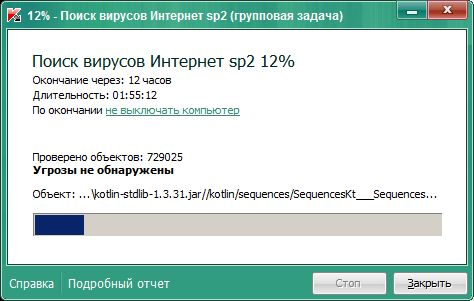
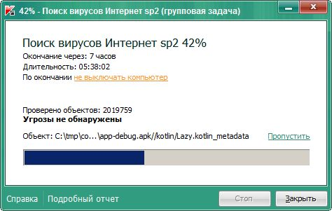
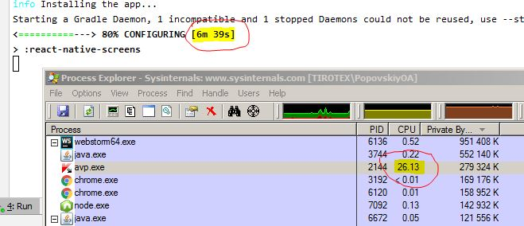

Начало - Пояснение
=
В этом файлике будут какбэ такие шутки.
Шуточки - шутеечки на тему РН. Ну как бы нельзя ж всё время серьёзно лоб морщить.
Надо иногда и лыбу тянуть. Но т.к. отвлекаться от познания РН далеко не рекомендуется,
предлагается и футить на тему РН. 

Будет небольшой текст вначале, потом картинка или мотиватор.
И небольшой текст в конце.

**Внимание!** Юморное слово подчёркиваться не будет, допетривайте сами - в чём прикол.

**Типа содержание**
1. [Начало - Пояснение](#id-s0)
1. [Футка 1](#id-s1)
1. [Футка 2](#id-s2)
1. [Футка 3](#id-s3)

# Футка 1
Когда в понедельник забыл скрыться в Хельмову Падь

Каждый понедельник у нас на работе включается каспер.
Это у нас такая политика безопасности. Типа защита от вирусов.
Каспер настроет так, что он проверяет всё. Ну просто всё.
Всё, что есть на диске:
1. Пускай я его не трогал за прошедшую неделю, за прошедший месяц, за прошедший год, за прошедшие три года, он не изменный с 2014. - Надо проверить.
1. Пускай этот файл - картинка JPEG. - Надо проверить.
1. Пускай этот файл лежит в папке OpenServer или Android, в которой вместе с ним лежит ещё десятки тысяч таких же маленьких файликов с расширениями HTML, Java, JS, TS, TSX, XML, PHP. - Надо проверить.
1. Пускай этот файл - файл установки. - Надо проверить.
1. Пускай это флешка, которую воткнули в 10:55 и забыли выткнуть. - Надо проверить.

При этом:
1. проверка выполняется с эвристическим анализом, то есть тщательно.
При проверке jar-файла лезут внутрь архива и тщательно проверяют все java-файлы, которые внутри. Аналогично, внутрь любого архива, в том числе - с фотографиями.
Аналогично, установочные/инсталяционные файлы (дистрибутивы).
1. работает Kaspersky Endpoint Security 10 for Windows 2017 года х32
на Windows 7 x64 c 4 Гб ОЗУ DDD3.
Хорошо хоть сейчас SSD-диск на диск С поставили. Раньше вообще работать нельзя было.
1. Настройки недоступны даже на просмотр - спрашивают пароль KLAdmin. Остановить службу, снять (kill) процесс - отказано в доступе.

В результате имеем то, что имеем. 
Окончание загрузки - через 12 часов.
Любое обращение к админу породит лишние вопросы и подозрения в духе "А чем же ты на работе занимаешься, если у тебя на компе полно JPEG-файлов? Java-файлов? TS-файлов? PHP-файлов? А не сошёл ли ты с великого Delphi-Informix-Oracle-SQL-пути, выбрав пианину?"

С точки зрения админа, любой комп с интернетом представляет из себя огромную зияющую брешь в безопасности, которую можно хоть как-то закрыть, только если регулярно запускать вот такие вот ковровые проверки всего и вся.

Единственное спасение - запаковать файлы на время в запароленый архив. Без сжатия.
Хельмова Падь была придумана специально для таких папок и файлов.
Бывшие папки превращаются каждый понедельник в запароленые архивы без сжатия.
Спасаются в Хельмовой Пади, чтобы потом, после нашествия орков Каспера, восстановиться.
Иначе весь день будешь лицезреть информативную картинку

И даже т.н. "Подробный отчёт" нельзя открыть - спрашивают пароль KLAdmin. Какой там отчёт - это не твоё дело. Сиди и терпи.

Ещё одна возможность спасения - поставить Linux и сделать Dual Boot. Согласно требованиям безопасности, на компы с Linux каспер не нужен. Но это уже другая история и другая футка.

# Футка 2

Когда работодатель не хочет, чтобы ты менял направление деятельности

Ещё одна шутейка про каспер. Градл-Демон в ходе своей работы естественно, как любой процесс, подвергается проверке каспером в режиме реального времени. Градл работает, каспер бдит. Причём, не только бдит, но и проверяет вновь созданные файлы. А таких файлов у Градла великое множество. И вот каспер нагружает одно ядро проверкой временных файлов градла. 25% деградации, которых можно было бы избежать, если добавить папку градла в исключения (см. [Футка 1](#id-s1) ). Но это вызовет дополнительные вопросы.

В итоге имеем то, что имеем. Каспер грузит проц на 25%, градл билдит за 6+ минут.

# Футка 3

